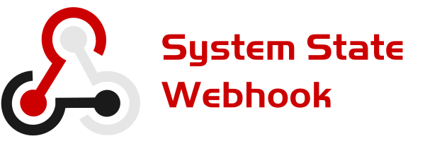

System State Webhook is free software allowing to call the desired URL (WebHook) on Windows startup, logon, logoff, shutdown.

# Events

The following events are implemented:

* Startup: Happens on first session start after system start
* Logon: Happens on system start, session start, session resume
* Logoff: Happens on system shutdown, session end, session lock, sleep and hibernate
* Shutdown: Happens on system shutdown

Note: For logoff event when AFK, simply configure a lock screen timeout on your system.

# Setup

1. Download and extract Zip file from the [Releases](https://github.com/ORelio/System-State-Webhook/releases) section
2. Launch `SystemStateWebhook.exe` once to generate configuration file
3. Edit `Webhooks.ini` and set desired webhooks for each event
4. Launch `SystemStateWebhook.exe` and try locking your session to see if it works well
5. Create a shortcut to `SystemStateWebhookHidden.exe` inside this folder to have it run on startup/logon:
```
%appdata%\Microsoft\Windows\Start Menu\Programs\Startup
```

# Credits

System State Webhook has been created using the following resources:

 - [Sharp-Tools](https://github.com/ORelio/Sharp-Tools) library, by ORelio
 - [Webhook icon](https://creazilla.com/media/icon/3211689/webhook), by Austin Andrews (with slight color changes)
 - [Handel Gothic](https://en.wikipedia.org/wiki/Handel_Gothic) font, by Donald J. Handel & Robert Trogman (Logo)

## License

System State Webhook is provided under
[CDDL-1.0](http://opensource.org/licenses/CDDL-1.0)
([Why?](http://qstuff.blogspot.fr/2007/04/why-cddl.html)).

Basically, you can use it or its source for any project, free or commercial, but if you improve it or fix issues,
the license requires you to contribute back by submitting a pull request with your improved version of the code.
Also, credit must be given to the original project, and license notices may not be removed from the code.
